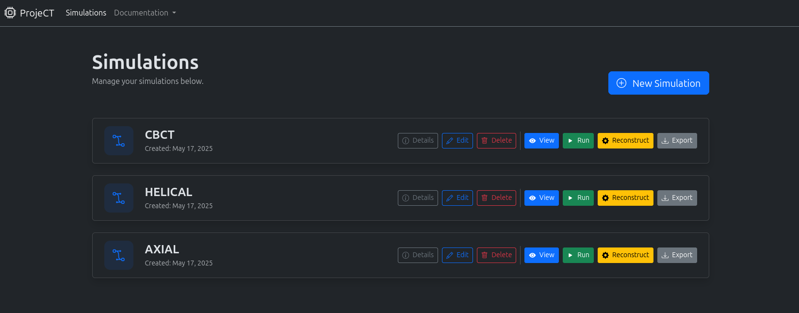
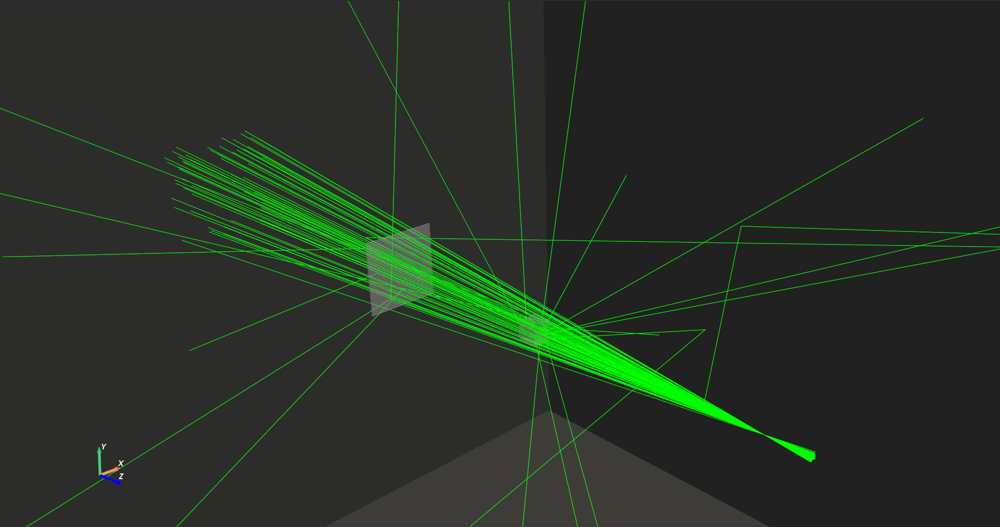

<h1 align="center">
    ProjeCT
</h1>

<p align="center">
    
    
    
    
    
    
</p>

Full-stack application for creating tomographic projections. It uses [FastAPI](https://fastapi.tiangolo.com/) for the backend to interface with [GATE 10](https://github.com/OpenGATE/opengate) and [LEAP](https://github.com/LLNL/LEAP), and [Angular](https://angular.dev/) for the frontend.

<p align="center">
    
</p>

## Features

### Keep track of your GATE simulations



### Manage your GATE simulations


### View your GATE simulation before running it



### Generate projections and reconstruct them

|                              Sinogram of a cube from a CBCT                             |                              Reconstructed middle slice of a cube from a CBCT                             |
| :-------------------------------------------------------------------------------------: | :-------------------------------------------------------------------------------------------------------: |
|  |  |

## Prerequisities

- Python 3.10+
- Node v22.15.0 or newer
- cmake version 3.23 or newer
- CUDA toolkit 11.7 or newer

## Setup

- Clone the repository

    ```bash
    git clone https://github.com/optui/ProjeCT.git
    cd ProjeCT
    ```

### Backend Setup

#### Environment

- Copy the template

    ```bash
    cp backend/.env.example backend/.env
    ```

#### Using [uv](https://github.com/astral-sh/uv)

1. Go to the backend directory

    ```bash
    cd backend
    ```

2. Create & activate virtual environment

    ```bash
    uv venv
    source .venv/bin/activate  # Windows: .venv\Scripts\activate
    ```

3. Install & lock dependencies

    ```bash
    uv sync
    ```

#### Using [virtualenv](https://virtualenv.pypa.io/en/latest/)

1. Go to the backend directory

    ```bash
    cd backend
    ```

2. Create & activate virtual environment

    ```bash
    python3 -m venv .venv
    source .venv/bin/activate  # Windows: .venv\Scripts\activate
    ```

3. Install dependencies

    ```bash
    pip install -e .
    ```

#### Integrating LEAP

ProjeCT relies on LLNL’s [LEAP](https://github.com/LLNL/LEAP) library for reconstructing generated projections.  
Before running ProjeCT, install and configure LEAP following this [link](https://github.com/LLNL/LEAP/wiki/Installing-LEAP-without-PyTorch).

1. Go to the backend directory

    ```bash
    cd backend
    ```

2. Activate virtual environment if it exists

    ```bash
    source .venv/bin/activate  # Windows: .venv\Scripts\activate
    ```

3. Clone the repository

    ```bash
    git clone https://github.com/LLNL/LEAP.git
    cd LEAP
    ```

4. From within `backend/LEAP/`, install the LEAP package

    ```bash
    pip install .
    ```

### Frontend Setup

1. Go to the frontend directory

    ```bash
    cd frontend
    ```

2. Install dependencies

    ```bash
    npm install
    ```

## Running

### Backend

1. Make run.sh executable

    ```bash
    chmod +x scripts/run.sh
    ```

2. Run the script

    > **Warning:** On the first run, GATE 10 will download and install Geant4 (~11GB).

    ```bash
    scripts/run.sh
    ```

3. Open the interactive API docs

    - [http://127.0.0.1:8000/docs](http://127.0.0.1:8000/docs)
    - [http://127.0.0.1:8000/redoc](http://127.0.0.1:8000/redoc)

### Frontend

- Run the frontend server

    ```bash
    ng serve
    ```

## Documentation

See the backend's [README](./backend/README.md) for API details and examples.

## License

Read [`LICENSE`](LICENSE).
